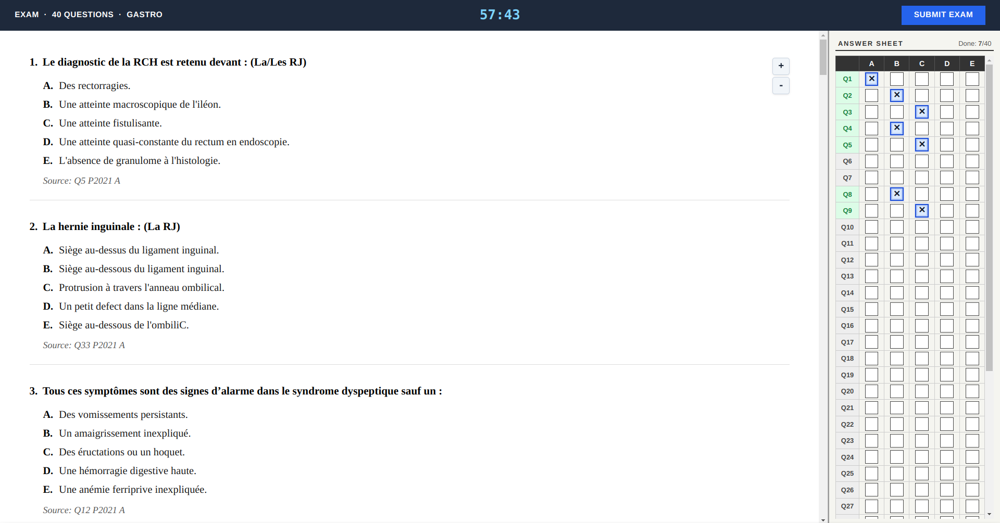
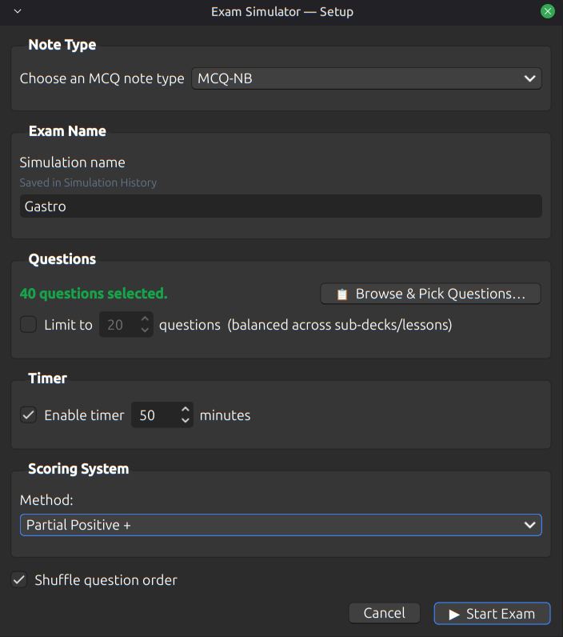

# Exam Simulator - NB

An Anki add-on that turns your MCQ note bank into a proper exam-style simulation workflow.

Instead of reviewing questions one by one in normal Anki mode, you can build custom exams, filter your question pool, apply timing and scoring rules, sit the exam in a dedicated interface, and review your performance afterward.

## Why this exists

Anki is excellent for recall. It is not, by default, an exam simulator.

If your note bank is built around MCQs, sometimes you do not want spaced repetition mode — you want to sit a paper, answer under constraints, then review mistakes like an actual exam.

That is what this add-on is for.

## What it does

Exam Simulator - NB lets you:

- build custom exams from your Anki MCQ notes
- filter questions by deck, tags, simulation history, and flags
- choose a fixed question count
- run timed or untimed sessions
- shuffle question order
- apply different scoring systems
- review detailed results question by question
- flag or tag selected questions after the exam
- keep simulation history locally without polluting normal Anki tags

## Screenshots

### Exam Setup

### Exam Interface

### Results Review

## Main Features

### Exam Builder
- choose the MCQ note type
- browse and select questions manually
- set the number of questions
- give the exam a name
- optionally shuffle question order

### Flexible Filtering
You can narrow the question pool using:
- Decks
- Tags
- Simulation History
- Flags

### Balanced Sampling
The add-on supports balanced round-robin style sampling across subdecks so a single deck does not dominate the exam unnecessarily.

### Exam Interface
- dedicated exam window
- exam-paper style question layout
- answer sheet grid on the side
- timer support
- zoom controls
- quick navigation between answer sheet and questions

### Scoring Modes
- **All or Nothing**
- **Partial Positive +**
- **Partial Negative -**

### Results Review
After submission, the results page gives you:
- overall score
- score out of 20
- percentage
- correct / partial / wrong / skipped breakdown
- per-question review
- optional explanation reveal
- bulk flagging and tagging for selected questions
- quick launch for another exam

### Local Simulation History
Named exams are stored locally by the add-on and can be reused later as a filter source.

You can:
- reuse prior simulations
- delete selected history items
- clear all history

This history is add-on-owned and local. It does **not** rely on normal Anki tags for storage.

## Expected Note Type

By default, the add-on is built around a note type named:

- `MCQ-NB`

It expects these fields:

- `Question`
- `option_1 (A)`
- `option_2 (B)`
- `option_3 (C)`
- `option_4 (D)`
- `option_5 (E)` *(optional if unused)*
- `Ans`
- `Source` *(optional)*
- `Explanation` *(optional)*

## Answer Format

The `Ans` field can use either letters or numbers.

Examples:
- `A`
- `B`
- `AC`
- `1`
- `13`

Mapping:
- `1 -> A`
- `2 -> B`
- `3 -> C`
- `4 -> D`
- `5 -> E`

## How it works

1. Open Anki
2. Go to **Tools → Exam Simulator - NB**
3. Choose the relevant MCQ note type
4. Filter or browse the questions you want
5. Set the number of questions
6. Name the exam if you want it saved in Simulation History
7. Choose timing and scoring options
8. Start the exam
9. Submit and review results

## Scoring Modes

### All or Nothing
A question only scores if the full answer is correct.

### Partial Positive +
Correct selections earn credit. Wrong selections reduce that partial credit, but the final score for the question does not go below zero.

### Partial Negative -
Correct selections earn credit. Wrong selections subtract credit and may push the raw question score below zero before the final exam total is normalized.

## Simulation History

Named simulations are stored in a local add-on file:

- `exam_simulator_history.json`

This file lives inside the current Anki profile folder.

Important:
- it is **local only**
- it does **not** create normal Anki tags
- deleting simulation history does **not** delete notes
- starting an unnamed exam does **not** save it in history

## Results Workflow

After an exam, you can:

- review each question
- reveal explanations
- filter results by status
- select specific questions
- bulk tag selected questions
- bulk flag selected questions
- start another exam immediately

## Privacy and Storage

This add-on stores simulation history locally in your Anki profile.

It does not require a server, account, or external backend.

## Known Limitations

- currently designed around a specific MCQ field structure
- best suited for note types that follow the expected field names
- not intended to be a universal quiz engine for arbitrary note schemas
- answer choice order is not currently randomized

## Roadmap

Potential future improvements:

- configurable field mapping from the UI
- support for more note schemas
- exportable exam reports
- richer analytics
- exam presets
- answer choice randomization

## License

MIT License.
